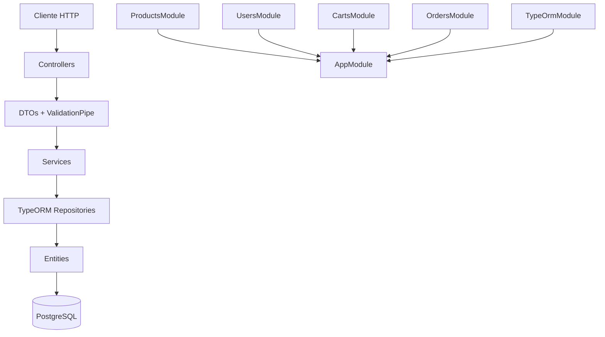
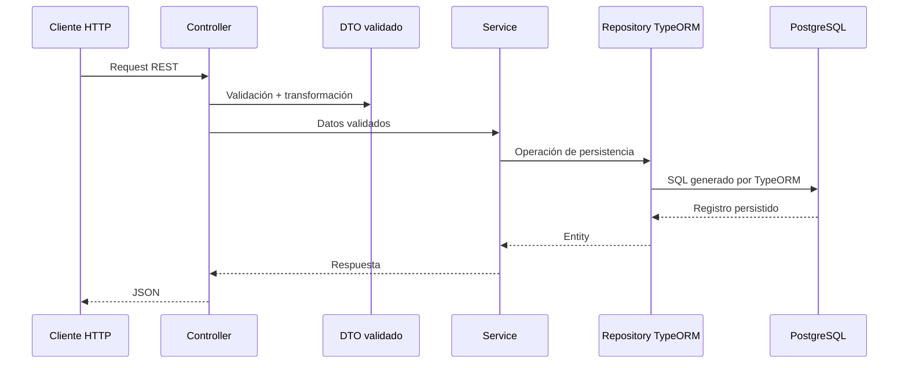
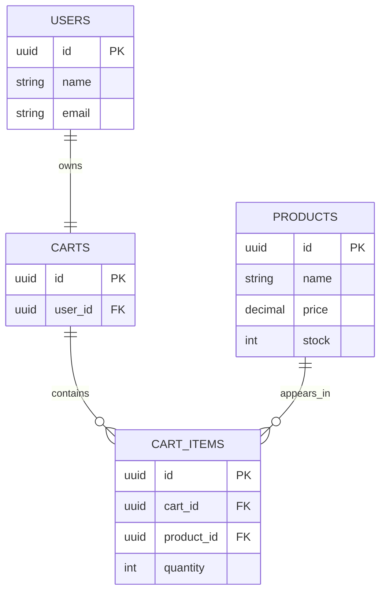
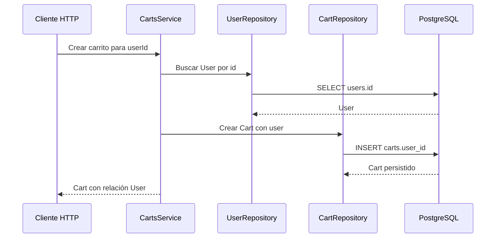

# Nivel 3: E-commerce API con NestJS + TypeORM

Guía paso a paso para construir una API REST de e-commerce usando NestJS, TypeScript, TypeORM, DTOs, validación y arquitectura modular.

## Objetivo

Crear una API backend con persistencia real en base de datos usando TypeORM.

Al finalizar, la API debe permitir:

- Crear, listar, buscar, actualizar y eliminar productos.
- Crear usuarios.
- Consultar usuarios.
- Agregar productos a un carrito.
- Consultar carrito por usuario.
- Crear órdenes desde un carrito.
- Consultar órdenes.

## Stack usado

- NestJS 11
- TypeScript
- TypeORM
- PostgreSQL
- Joi
- @nestjs/config
- Jest
- class-validator
- class-transformer

## Arquitectura esperada



## Flujo de datos



## Paso 1: Crear proyecto NestJS

Si empiezas desde cero, ejecuta:

```bash
nest new nivel-3-ecommerce-api
```

Entra al proyecto:

```bash
cd nivel-3-ecommerce-api
```

Instala dependencias base:

```bash
npm install
```

## Paso 2: Instalar validación, TypeORM y Joi

Instala paquetes para validar DTOs:

```bash
npm install class-validator class-transformer @nestjs/mapped-types
```

Instala TypeORM y PostgreSQL:

```bash
npm install @nestjs/typeorm typeorm pg
```

Instala configuración tipada y validación de `.env`:

```bash
npm install @nestjs/config joi
```

## Paso 3: Configurar variables de entorno con Joi

Crea un archivo `.env.example` con las variables necesarias:

```env
PORT=3000
DATABASE_HOST=localhost
DATABASE_PORT=5432
DATABASE_USER=postgres
DATABASE_PASSWORD=postgres
DATABASE_NAME=nivel_3_ecommerce
DATABASE_SYNCHRONIZE=true
```

Crea tu archivo `.env` local usando esos mismos nombres. No subas secretos reales al repositorio.

Joi validará el `.env` al iniciar la aplicación. Si falta una variable requerida o tiene un tipo inválido, NestJS detendrá el arranque con un error descriptivo.

## Paso 4: Activar ValidationPipe global

Edita `src/main.ts`:

```ts
import { ValidationPipe } from '@nestjs/common';
import { ConfigService } from '@nestjs/config';
import { NestFactory } from '@nestjs/core';
import { AppModule } from './app.module';

async function bootstrap() {
  const app = await NestFactory.create(AppModule);
  const configService = app.get(ConfigService);

  app.useGlobalPipes(
    new ValidationPipe({
      whitelist: true,
      forbidNonWhitelisted: true,
      transform: true,
    }),
  );

  await app.listen(configService.getOrThrow<number>('PORT'));
}
bootstrap();
```

Qué hace cada opción:

- `whitelist`: elimina propiedades no definidas en DTO.
- `forbidNonWhitelisted`: rechaza propiedades extras.
- `transform`: convierte datos recibidos al tipo declarado en DTO.

## Paso 5: Configurar TypeORM en AppModule

Edita `src/app.module.ts`:

```ts
import { Module } from '@nestjs/common';
import { ConfigModule, ConfigService } from '@nestjs/config';
import { TypeOrmModule } from '@nestjs/typeorm';
import * as Joi from 'joi';
import { ProductsModule } from './products/products.module';

@Module({
  imports: [
    ConfigModule.forRoot({
      isGlobal: true,
      validationSchema: Joi.object({
        PORT: Joi.number().port().default(3000),
        DATABASE_HOST: Joi.string().required(),
        DATABASE_PORT: Joi.number().port().default(5432),
        DATABASE_USER: Joi.string().required(),
        DATABASE_PASSWORD: Joi.string().required(),
        DATABASE_NAME: Joi.string().required(),
        DATABASE_SYNCHRONIZE: Joi.boolean().default(true),
      }),
    }),
    TypeOrmModule.forRootAsync({
      inject: [ConfigService],
      useFactory: (configService: ConfigService) => ({
        type: 'postgres',
        host: configService.getOrThrow<string>('DATABASE_HOST'),
        port: configService.getOrThrow<number>('DATABASE_PORT'),
        username: configService.getOrThrow<string>('DATABASE_USER'),
        password: configService.getOrThrow<string>('DATABASE_PASSWORD'),
        database: configService.getOrThrow<string>('DATABASE_NAME'),
        autoLoadEntities: true,
        synchronize: configService.getOrThrow<boolean>('DATABASE_SYNCHRONIZE'),
      }),
    }),
    ProductsModule,
  ],
})
export class AppModule {}
```

`DATABASE_SYNCHRONIZE=true` sirve solo para práctica local. En proyectos productivos usa migraciones y cambia ese valor a `false`.

## Paso 6: Crear módulo de productos

Genera módulo, controller y service:

```bash
nest generate module products
nest generate controller products
nest generate service products
```

Estructura esperada:

```text
src/products/
├── dto/
│   ├── create-product.dto.ts
│   └── update-product.dto.ts
├── entities/
│   └── product.entity.ts
├── products.controller.ts
├── products.module.ts
└── products.service.ts
```

Crea carpetas:

```bash
mkdir -p src/products/dto src/products/entities
```

## Paso 7: Crear entidad Product

Crea `src/products/entities/product.entity.ts`:

```ts
import { Column, CreateDateColumn, Entity, PrimaryGeneratedColumn, UpdateDateColumn } from 'typeorm';

@Entity({ name: 'products' })
export class Product {
  @PrimaryGeneratedColumn('uuid')
  id: string;

  @Column({ type: 'varchar', length: 120 })
  name: string;

  @Column({ type: 'text' })
  description: string;

  @Column({ type: 'decimal', precision: 10, scale: 2 })
  price: number;

  @Column({ type: 'int', default: 0 })
  stock: number;

  @Column({ type: 'varchar', length: 80 })
  category: string;

  @CreateDateColumn({ name: 'created_at' })
  createdAt: Date;

  @UpdateDateColumn({ name: 'updated_at' })
  updatedAt: Date;
}
```

## Paso 8: Crear DTOs de productos

Crea `src/products/dto/create-product.dto.ts`:

```ts
import { IsInt, IsNotEmpty, IsNumber, IsPositive, IsString, Min } from 'class-validator';

export class CreateProductDto {
  @IsString()
  @IsNotEmpty()
  name: string;

  @IsString()
  @IsNotEmpty()
  description: string;

  @IsNumber()
  @IsPositive()
  price: number;

  @IsInt()
  @Min(0)
  stock: number;

  @IsString()
  @IsNotEmpty()
  category: string;
}
```

Crea `src/products/dto/update-product.dto.ts`:

```ts
import { PartialType } from '@nestjs/mapped-types';
import { CreateProductDto } from './create-product.dto';

export class UpdateProductDto extends PartialType(CreateProductDto) {}
```

## Paso 9: Registrar entidad en ProductsModule

Edita `src/products/products.module.ts`:

```ts
import { Module } from '@nestjs/common';
import { TypeOrmModule } from '@nestjs/typeorm';
import { Product } from './entities/product.entity';
import { ProductsController } from './products.controller';
import { ProductsService } from './products.service';

@Module({
  imports: [TypeOrmModule.forFeature([Product])],
  controllers: [ProductsController],
  providers: [ProductsService],
  exports: [ProductsService],
})
export class ProductsModule {}
```

## Paso 10: Implementar ProductsService con Repository

Edita `src/products/products.service.ts`:

```ts
import { Injectable, NotFoundException } from '@nestjs/common';
import { InjectRepository } from '@nestjs/typeorm';
import { Repository } from 'typeorm';
import { CreateProductDto } from './dto/create-product.dto';
import { UpdateProductDto } from './dto/update-product.dto';
import { Product } from './entities/product.entity';

@Injectable()
export class ProductsService {
  constructor(
    @InjectRepository(Product)
    private readonly productsRepository: Repository<Product>,
  ) {}

  async create(createProductDto: CreateProductDto): Promise<Product> {
    const product = this.productsRepository.create(createProductDto);
    return this.productsRepository.save(product);
  }

  async findAll(): Promise<Product[]> {
    return this.productsRepository.find({ order: { createdAt: 'DESC' } });
  }

  async findOne(id: string): Promise<Product> {
    const product = await this.productsRepository.findOne({ where: { id } });

    if (!product) {
      throw new NotFoundException(`Producto con id ${id} no encontrado`);
    }

    return product;
  }

  async update(id: string, updateProductDto: UpdateProductDto): Promise<Product> {
    const product = await this.findOne(id);
    const updatedProduct = this.productsRepository.merge(product, updateProductDto);
    return this.productsRepository.save(updatedProduct);
  }

  async remove(id: string): Promise<void> {
    const product = await this.findOne(id);
    await this.productsRepository.remove(product);
  }
}
```

## Paso 11: Implementar ProductsController

Edita `src/products/products.controller.ts`:

```ts
import { Body, Controller, Delete, Get, Param, ParseUUIDPipe, Patch, Post } from '@nestjs/common';
import { CreateProductDto } from './dto/create-product.dto';
import { UpdateProductDto } from './dto/update-product.dto';
import { ProductsService } from './products.service';

@Controller('products')
export class ProductsController {
  constructor(private readonly productsService: ProductsService) {}

  @Post()
  create(@Body() createProductDto: CreateProductDto) {
    return this.productsService.create(createProductDto);
  }

  @Get()
  findAll() {
    return this.productsService.findAll();
  }

  @Get(':id')
  findOne(@Param('id', ParseUUIDPipe) id: string) {
    return this.productsService.findOne(id);
  }

  @Patch(':id')
  update(@Param('id', ParseUUIDPipe) id: string, @Body() updateProductDto: UpdateProductDto) {
    return this.productsService.update(id, updateProductDto);
  }

  @Delete(':id')
  remove(@Param('id', ParseUUIDPipe) id: string) {
    return this.productsService.remove(id);
  }
}
```

## Paso 12: Crear módulo de usuarios con TypeORM

Genera archivos:

```bash
nest generate module users
nest generate controller users
nest generate service users
mkdir -p src/users/dto src/users/entities
```

Entidad recomendada `src/users/entities/user.entity.ts`:

```ts
import { Column, CreateDateColumn, Entity, PrimaryGeneratedColumn } from 'typeorm';

@Entity({ name: 'users' })
export class User {
  @PrimaryGeneratedColumn('uuid')
  id: string;

  @Column({ type: 'varchar', length: 120 })
  name: string;

  @Column({ type: 'varchar', length: 180, unique: true })
  email: string;

  @CreateDateColumn({ name: 'created_at' })
  createdAt: Date;
}
```

DTO recomendado `src/users/dto/create-user.dto.ts`:

```ts
import { IsEmail, IsNotEmpty, IsString } from 'class-validator';

export class CreateUserDto {
  @IsString()
  @IsNotEmpty()
  name: string;

  @IsEmail()
  email: string;
}
```

Endpoints básicos:

```text
POST /users
GET /users
GET /users/:id
```

## Paso 13: Crear módulo de carrito con relaciones

Genera archivos:

```bash
nest generate module carts
nest generate controller carts
nest generate service carts
mkdir -p src/carts/dto src/carts/entities
```

Modelo recomendado:

- `Cart`: pertenece a un usuario.
- `CartItem`: pertenece a un carrito y referencia un producto.
- `CartItem.quantity`: guarda cantidad del producto.

Relaciones TypeORM recomendadas:

```text
User 1 ── 1 Cart
Cart 1 ── N CartItem
Product 1 ── N CartItem
```

DTOs recomendados:

`AddCartItemDto` recibe `productId` y `quantity`, porque el producto nuevo viene en el body.

```ts
import { IsInt, IsPositive, IsUUID } from 'class-validator';

export class AddCartItemDto {
  @IsUUID()
  productId: string;

  @IsInt()
  @IsPositive()
  quantity: number;
}
```

`UpdateCartItemDto` recibe solo `quantity`, porque `productId` ya viene en la URL.

```ts
import { IsInt, IsPositive } from 'class-validator';

export class UpdateCartItemDto {
  @IsInt()
  @IsPositive()
  quantity: number;
}
```

Endpoints básicos:

```text
GET /carts/:userId
POST /carts/:userId/items
PATCH /carts/:userId/items/:productId
DELETE /carts/:userId/items/:productId
DELETE /carts/:userId
```

Mapeo controller → service:

```text
GET /carts/:userId                         -> getCartWithItems(userId)
POST /carts/:userId/items                  -> addItem(userId, dto.productId, dto.quantity)
PATCH /carts/:userId/items/:productId      -> updateItemQuantity(userId, productId, dto.quantity)
DELETE /carts/:userId/items/:productId     -> removeItem(userId, productId)
DELETE /carts/:userId                      -> clearCart(userId)
```

Reglas:

- Usa `ParseUUIDPipe` en `userId` y `productId`.
- Usa `AddCartItemDto` solo para agregar producto.
- Usa `UpdateCartItemDto` solo para cambiar cantidad.
- No recibas `productId` como `@Body() productId: string`; recibe DTO completo con `@Body() dto`.
- Controller no crea lógica de carrito; solo delega en `CartsService`.

## Paso 14: Crear módulo de órdenes con relaciones

Genera archivos:

```bash
nest generate module orders
nest generate controller orders
nest generate service orders
mkdir -p src/orders/entities
```

Modelo recomendado:

- `Order`: pertenece a un usuario.
- `OrderItem`: guarda snapshot del producto comprado.
- `Order.total`: suma final de la orden.

Relaciones TypeORM recomendadas:

```text
User 1 ── N Order
Order 1 ── N OrderItem
```

Endpoints básicos:

```text
POST /orders/from-cart/:userId
GET /orders
GET /orders/:id
```

`POST /orders/from-cart/:userId` crea la orden dentro de una transacción con `QueryRunner`:

1. Busca el carrito del usuario con sus items y productos.
2. Si el carrito no existe o está vacío, lanza `BadRequestException`.
3. Por cada item valida stock disponible; si falta stock, lanza `ConflictException` y revierte todo.
4. Descuenta el stock del producto y crea el `OrderItem` con snapshot de `productName` y `unitPrice`.
5. Guarda la `Order` con el total calculado y vacía el carrito (`CartItem`).
6. Si algo falla en el camino, hace `rollbackTransaction()`; si todo sale bien, hace `commitTransaction()`.

## Migraciones

Para proyectos reales, desactiva `synchronize` y usa migraciones:

```ts
synchronize: false,
```

Comandos recomendados:

```bash
npm run typeorm migration:generate -- src/database/migrations/CreateInitialSchema
npm run typeorm migration:run
```

Si el proyecto todavía no tiene scripts de TypeORM, agrega scripts específicos en `package.json` antes de ejecutar migraciones.

## Variables de entorno

Variables esperadas y validadas con Joi:

```env
PORT=3000
DATABASE_HOST=localhost
DATABASE_PORT=5432
DATABASE_USER=postgres
DATABASE_PASSWORD=postgres
DATABASE_NAME=nivel_3_ecommerce
DATABASE_SYNCHRONIZE=true
```

Reglas de validación:

- `PORT`: número de puerto válido. Valor por defecto: `3000`.
- `DATABASE_HOST`: string requerido.
- `DATABASE_PORT`: número de puerto válido. Valor por defecto: `5432`.
- `DATABASE_USER`: string requerido.
- `DATABASE_PASSWORD`: string requerido.
- `DATABASE_NAME`: string requerido.
- `DATABASE_SYNCHRONIZE`: booleano. Valor por defecto: `true`.

## Ejecutar proyecto

Levanta PostgreSQL local y crea la base de datos `nivel_3_ecommerce`.

Instala dependencias:

```bash
npm install
```

Ejecuta en modo desarrollo:

```bash
npm run start:dev
```

La API queda disponible en:

```text
http://localhost:3000
```

## Modelo de carrito

Relación base:

```text
User 1 ── 1 Cart
```

Un usuario tiene un solo carrito. Un carrito pertenece a un solo usuario. La FK vive en `carts.user_id` porque `Cart` es el lado dueño de la relación.



En `Cart`, usa `@OneToOne` con `@JoinColumn`:

```ts
@OneToOne(() => User, (user) => user.cart, {
  nullable: false,
  onDelete: 'CASCADE',
})
@JoinColumn({ name: 'user_id' })
user: User;
```

En `User`, usa lado inverso sin `@JoinColumn`:

```ts
@OneToOne(() => Cart, (cart) => cart.user)
cart: Cart;
```

Regla importante: `quantity` no pertenece a `Cart`. Pertenece a `CartItem`, porque un carrito puede contener varios productos con cantidades distintas.

```text
Cart
- id
- user_id

CartItem
- id
- cart_id
- product_id
- quantity
```

Flujo esperado:



## Endpoints principales

### Productos

```text
POST /products
GET /products
GET /products/:id
PATCH /products/:id
DELETE /products/:id
```

Ejemplo de body para crear producto:

```json
{
  "name": "Laptop",
  "description": "Laptop para desarrollo",
  "price": 1200,
  "stock": 10,
  "category": "computers"
}
```

### Usuarios

```text
POST /users
GET /users
GET /users/:id
```

Ejemplo de body para crear usuario:

```json
{
  "name": "Luis",
  "email": "luis@example.com"
}
```

### Carrito

```text
GET /carts/:userId
POST /carts/:userId/items
PATCH /carts/:userId/items/:productId
DELETE /carts/:userId/items/:productId
DELETE /carts/:userId
```

Consistencia HTTP:

- `GET`: consulta carrito con items.
- `POST`: agrega producto al carrito.
- `PATCH`: cambia cantidad de producto existente.
- `DELETE /items/:productId`: elimina producto del carrito.
- `DELETE /:userId`: vacía carrito completo.

Ejemplo de body para agregar producto (`AddCartItemDto`):

```json
{
  "productId": "uuid-del-producto",
  "quantity": 2
}
```

Ejemplo de body para actualizar cantidad (`UpdateCartItemDto`):

```json
{
  "quantity": 3
}
```

Mapeo con `CartsService`:

```text
GET /carts/:userId                         -> getCartWithItems(userId)
POST /carts/:userId/items                  -> addItem(userId, productId, quantity)
PATCH /carts/:userId/items/:productId      -> updateItemQuantity(userId, productId, quantity)
DELETE /carts/:userId/items/:productId     -> removeItem(userId, productId)
DELETE /carts/:userId                      -> clearCart(userId)
```

### Órdenes

```text
POST /orders/from-cart/:userId
GET /orders
GET /orders/:id
```

## Reglas de implementación

- Usa entidades TypeORM en `entities/`.
- Usa `TypeOrmModule.forFeature()` por módulo.
- Inyecta repositorios con `@InjectRepository(Entity)`.
- Valida entradas con DTOs y `class-validator`.
- Usa `ParseUUIDPipe` para parámetros UUID.
- Usa relaciones TypeORM para carrito y órdenes.
- Usa migraciones cuando el esquema deje de ser de práctica local.
- No uses persistencia en memoria para módulos finales.

## Verificación

Ejecuta verificación de tipos antes de cerrar cambios:

```bash
npx tsc --noEmit
```

También puedes ejecutar pruebas existentes cuando agregues lógica nueva:

```bash
npm test
```
